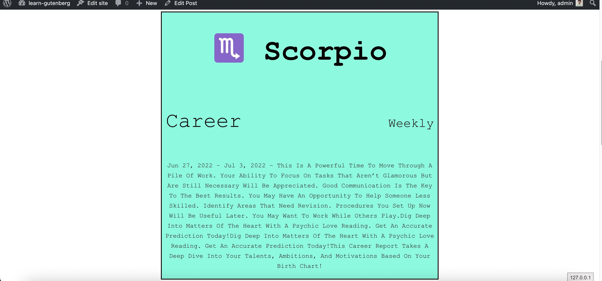
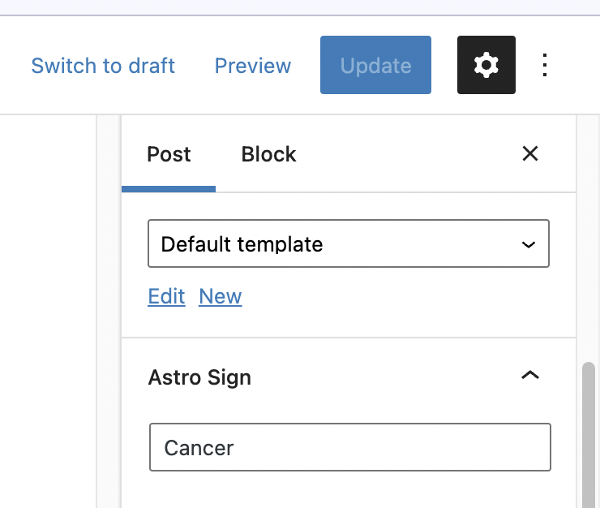
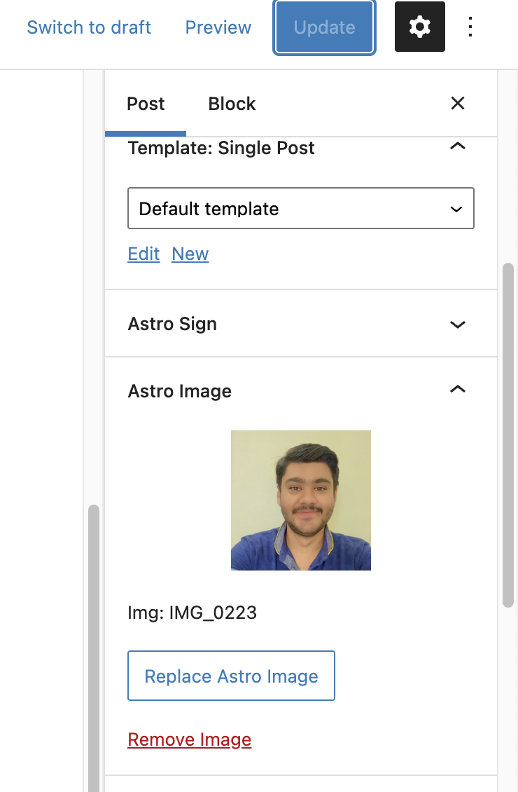

## Astrology Horoscope Block

- This block is used to display the horoscope for any zodiac sign for category such as career, love etc and for today, monthly and weekly.
- This block is created using `@wordpress/create-block` package.
- This block uses the select block control with option to select the zodiac sign, category and duration.
- On any change to value block will hit the respective API provided by the rapid API platform and fetch the results and show pn editor + frontend ( post-published ) view.

## Features
1. Custom Astro Block
2. Custom Single Post Block, to display the post with feature image, title, excerpt and date with hide facility from editor.
3. InnerBlocks
4. Meta Fields
   1. Astro Text Meta
   2. Astro Image Meta
   3. Astro Category Autocomplete Meta
5. CoreBlock Filter ( core/paragraph ) to add prefix as Astro text meta ( only to editor side ).

## Images
### Editor
- Editor Image

### Frontend
- Frontend Image

### Meta Fields
- Text Control Meta

- Media Upload Meta

- Astro Autocomplete Meta Video - https://watch.screencastify.com/v/xKqvMgteL1SPUkpOYrCn

## Single Post Block
- Video - https://watch.screencastify.com/v/7VBrDbglzzMVe5wR4mmz

##InnerBlocks Concepts

